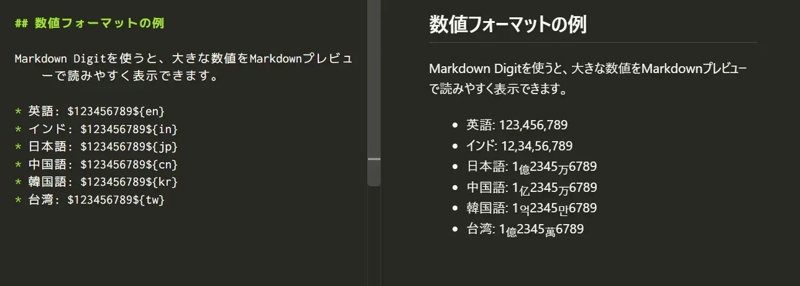

# Markdown Digit

[English](README.md) | [日本語](README.jp.md) | [简体中文](README.zh-cn.md) | [한국어](README.ko.md) | [繁體中文](README.zh-tw.md)


[`markdown-it-digit`](https://www.npmjs.com/package/markdown-it-digit)を使用して、
ロケールを指定した整数をVisual Studio CodeのMarkdownプレビュー内で整形します。

この拡張機能が変更するのはレンダリングされたプレビューだけです。
エディター内のMarkdownソースは変更しません。

## インストール
Visual Studio Code の拡張機能で「Markdown Digit」と入力してください｡

## 使用方法

Markdownファイルを開き、次の構文で整数を記述します。

```md
$<number>${<locale>}
```

例:

```md
$1234567${en}
```

プレビューでは`1,234,567`と表示され、ソースは変更されません。



`<number>`には1文字以上のASCII数字（`0`～`9`）を指定します。
先頭のゼロは維持され、ロケール識別子では大文字と小文字が区別されます。

## 文書全体の自動変換

VS Code設定でデフォルトのロケールを指定すると、通常の文章に書かれた数字を文書全体で自動変換できます。初期状態では自動変換は無効です。

```json
{
    "markdownDigit.locale": "jp",
    "markdownDigit.minDigits": 4
}
```

`markdownDigit.locale`には`en`、`in`、`jp`、`cn`、`kr`、`tw`のいずれかを指定します。空の値を選ぶと自動変換は無効になります。

`markdownDigit.minDigits`は自動変換する最小桁数で、初期値は`4`です。たとえば`locale: en`、`minDigits: 4`では、`999`はそのまま、`1000`は`1,000`になります。

文書ごとに設定を変える場合は、Markdown文書の先頭へYAML Front Matterを記述します。

```yaml
---
markdown:
  digit:
    locale: jp
    minDigits: 4
---
```

この文書では、通常の文章にある`123456789`が`1億2345万6789`として表示されます。YAML Front Matterは文書先頭にある場合だけ読み取られます。不正なYAMLや`markdown.digit`がないFront Matterは無視され、VS Code設定が使用されます。

設定はプロパティ単位で、次の優先順位で適用されます。

```text
本文の明示記法
> YAML Front Matter
> VS Code設定
> 設定なし
```

文書全体が自動変換される場合でも、`$1234567${en}`のような明示localeはその数字だけ設定を上書きします。`$1234567${raw}`と記述すると、マーカーを除いた`1234567`を変換せずに表示できます。

## 対応ロケール

| ロケール | `$123456789${locale}`のプレビュー表示 |
| --- | --- |
| `en` | `123,456,789` |
| `in` | `12,34,56,789` |
| `jp` | `1`億`2345`万`6789` |
| `cn` | `1`亿`2345`万`6789` |
| `kr` | `1`억`2345`만`6789` |
| `tw` | `1`億`2345`萬`6789` |

東アジアの単位はMarkdownプレビュー内で下付き文字として表示されます。
`jp`、`cn`、`kr`、`tw`は`markdown-it-digit`で定義された形式識別子であり、
ISO言語コードやBCP 47言語タグではありません。

## 変換されない内容

この拡張機能は、次の内容を変更しません。

- 自動変換用のlocaleが設定されていない場合の通常の数値
- 無効な構文、未対応のロケール、大文字と小文字が誤っているロケール
- フェンスコードブロックとインデントコードブロック
- インラインコード
- URLとMarkdownリンクのリンク先
- HTML属性とHTMLコメント
- Markdownのバックスラッシュでエスケープされた構文

解析および整形の完全な動作については、
[`markdown-it-digit`のドキュメント](https://github.com/yusu79/markdown-it-digit/blob/main/README.jp.md)と
[仕様書](https://github.com/yusu79/markdown-it-digit/blob/main/docs/specification.md)を参照してください。

## 必要環境

- Visual Studio Code 1.125.0以降

## ライセンス

[MIT](LICENSE)
