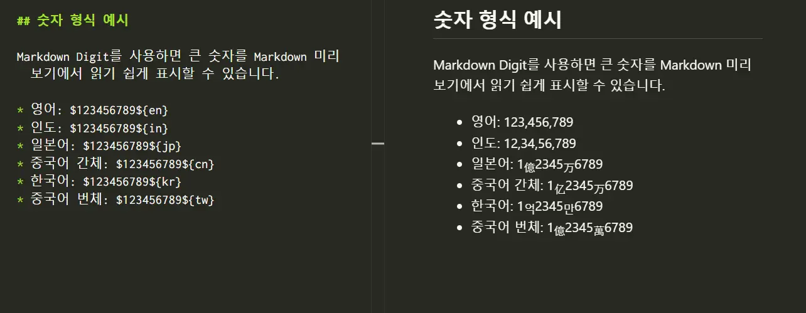

# Markdown Digit

[English](README.md) | [日本語](README.jp.md) | [简体中文](README.zh-cn.md) | [한국어](README.ko.md) | [繁體中文](README.zh-tw.md)


[`markdown-it-digit`](https://www.npmjs.com/package/markdown-it-digit)를 사용하여 Visual Studio Code의 Markdown 미리 보기에서 로캘이 지정된 정수를 형식화합니다.

이 확장은 렌더링된 미리 보기만 변경하며 편집기의 Markdown 원본은 수정하지 않습니다.

## 설치

Visual Studio Code 확장 보기에서 “Markdown Digit”를 검색하세요.

## 사용 방법

Markdown 파일을 열고 다음 구문으로 정수를 입력합니다.

```md
$<number>${<locale>}
```

예:

```md
$1234567${en}
```

미리 보기에는 `1,234,567`로 표시되며 원본 파일은 변경되지 않습니다.



`<number>`에는 하나 이상의 ASCII 숫자(`0`～`9`)를 입력해야 합니다. 앞에 있는 0은 유지되며 로캘 식별자는 대소문자를 구분합니다.

## 문서 전체 자동 형식화

VS Code 설정에서 기본 로캘을 지정하면 Markdown 문서의 일반 숫자를 자동으로 형식화할 수 있습니다. 자동 형식화는 기본적으로 꺼져 있습니다.

```json
{
    "markdownDigit.locale": "kr",
    "markdownDigit.minDigits": 4
}
```

`markdownDigit.locale`에는 `en`, `in`, `jp`, `cn`, `kr`, `tw` 중 하나를 지정할 수 있습니다. 빈 값을 선택하면 자동 형식화가 꺼집니다.

`markdownDigit.minDigits`는 자동 형식화를 적용할 최소 자릿수이며 기본값은 `4`입니다. 예를 들어 `locale: en`, `minDigits: 4`이면 `999`는 그대로 유지되고 `1000`은 `1,000`으로 표시됩니다.

한 문서에서만 기본 설정을 재정의하려면 Markdown 파일 맨 앞에 YAML Front Matter를 추가합니다.

```yaml
---
markdown:
  digit:
    locale: kr
    minDigits: 4
---
```

이 문서에서는 일반 숫자 `123456789`가 `1억2345만6789`로 표시됩니다. YAML Front Matter는 문서 맨 앞에 있을 때만 읽습니다. 잘못된 YAML 또는 `markdown.digit`가 없는 Front Matter는 무시되고 VS Code 설정이 사용됩니다.

각 설정 속성은 다음 우선순위로 결정됩니다.

```text
본문의 명시적 표기
> YAML Front Matter
> VS Code 설정
> 설정 없음
```

문서 전체 자동 형식화가 활성화되어 있어도 `$1234567${en}`과 같은 명시적 로캘은 해당 숫자의 설정을 재정의합니다. `$1234567${raw}`를 사용하면 표기를 제거하고 `1234567`을 변환하지 않은 채 표시할 수 있습니다.

## 지원 로캘

| 로캘 | `$123456789${locale}` 미리 보기 결과 |
| --- | --- |
| `en` | `123,456,789` |
| `in` | `12,34,56,789` |
| `jp` | `1`億`2345`万`6789` |
| `cn` | `1`亿`2345`万`6789` |
| `kr` | `1`억`2345`만`6789` |
| `tw` | `1`億`2345`萬`6789` |

동아시아 단위는 Markdown 미리 보기에서 아래 첨자로 표시됩니다. `jp`, `cn`, `kr`, `tw`는 `markdown-it-digit`에서 정의한 형식 식별자이며 ISO 언어 코드나 BCP 47 언어 태그가 아닙니다.

## 변환되지 않는 내용

이 확장은 다음 내용을 변경하지 않습니다.

- 자동 형식화 로캘이 설정되지 않았을 때의 일반 숫자
- 잘못된 구문, 지원되지 않는 로캘 또는 대소문자가 잘못된 로캘
- 펜스 코드 블록과 들여쓰기 코드 블록
- 인라인 코드
- URL과 Markdown 링크 대상
- HTML 속성과 HTML 주석
- Markdown 역슬래시로 이스케이프한 구문

전체 파싱 및 형식화 동작은 [`markdown-it-digit` 문서](https://github.com/yusu79/markdown-it-digit#readme)와 [사양](https://github.com/yusu79/markdown-it-digit/blob/main/docs/specification.md)을 참조하세요.

## 요구 사항

- Visual Studio Code 1.125.0 이상

## 라이선스

[MIT](LICENSE)
