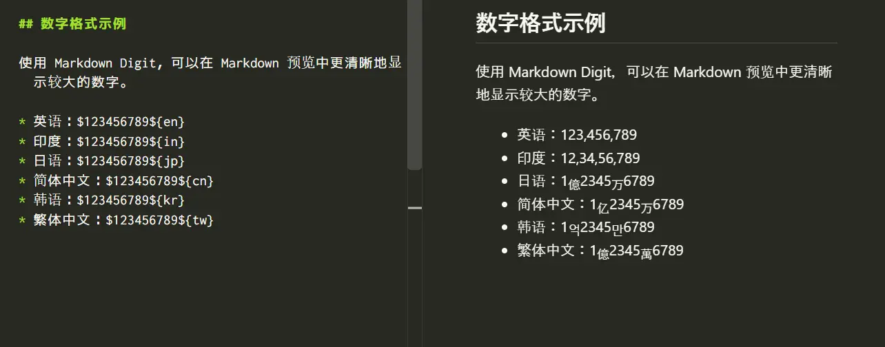

# Markdown Digit

[English](README.md) | [日本語](README.jp.md) | [简体中文](README.zh-cn.md) | [한국어](README.ko.md) | [繁體中文](README.zh-tw.md)


使用 [`markdown-it-digit`](https://www.npmjs.com/package/markdown-it-digit)，在 Visual Studio Code 的 Markdown 预览中格式化指定了区域设置的整数。

此扩展只更改渲染后的预览，不会修改编辑器中的 Markdown 源文件。

## 安装

在 Visual Studio Code 的扩展视图中搜索“Markdown Digit”。

## 使用方法

打开 Markdown 文件，使用以下语法输入整数：

```md
$<number>${<locale>}
```

例如：

```md
$1234567${en}
```

预览中会显示为 `1,234,567`，源文件保持不变。



`<number>` 必须包含一个或多个 ASCII 数字（`0`～`9`）。开头的零会被保留，区域设置标识符区分大小写。

## 整篇文档自动格式化

在 VS Code 设置中指定默认区域设置后，可以自动格式化 Markdown 文档正文中的普通数字。默认情况下自动格式化处于关闭状态。

```json
{
    "markdownDigit.locale": "cn",
    "markdownDigit.minDigits": 4
}
```

`markdownDigit.locale` 可设置为 `en`、`in`、`jp`、`cn`、`kr` 或 `tw`。选择空值可关闭自动格式化。

`markdownDigit.minDigits` 指定自动格式化所需的最少位数，默认值为 `4`。例如，当 `locale: en`、`minDigits: 4` 时，`999` 保持不变，而 `1000` 显示为 `1,000`。

如果要仅覆盖某一篇文档的默认设置，请在 Markdown 文件开头添加 YAML Front Matter：

```yaml
---
markdown:
  digit:
    locale: cn
    minDigits: 4
---
```

在此文档中，普通数字 `123456789` 会显示为 `1亿2345万6789`。仅当 YAML Front Matter 位于文档开头时才会读取。无效的 YAML 或不包含 `markdown.digit` 的 Front Matter 会被忽略，并继续使用 VS Code 设置。

各项设置按照以下优先级分别解析：

```text
正文中的显式标记
> YAML Front Matter
> VS Code 设置
> 无设置
```

即使已启用整篇文档自动格式化，`$1234567${en}` 这样的显式区域设置也会仅覆盖该数字。使用 `$1234567${raw}` 可以移除标记并原样显示 `1234567`。

## 支持的区域设置

| 区域设置 | `$123456789${locale}` 的预览结果 |
| --- | --- |
| `en` | `123,456,789` |
| `in` | `12,34,56,789` |
| `jp` | `1`億`2345`万`6789` |
| `cn` | `1`亿`2345`万`6789` |
| `kr` | `1`억`2345`만`6789` |
| `tw` | `1`億`2345`萬`6789` |

东亚语言的单位会在 Markdown 预览中以下标显示。`jp`、`cn`、`kr` 和 `tw` 是 `markdown-it-digit` 定义的格式标识符，并非 ISO 语言代码或 BCP 47 语言标签。

## 不会转换的内容

此扩展不会更改以下内容：

- 未设置自动格式化区域时的普通数字
- 无效语法、未支持的区域设置或大小写错误的区域设置
- 围栏式和缩进式代码块
- 行内代码
- URL 和 Markdown 链接目标
- HTML 属性和 HTML 注释
- 使用 Markdown 反斜杠转义的语法

有关完整的解析和格式化行为，请参阅 [`markdown-it-digit` 文档](https://github.com/yusu79/markdown-it-digit#readme)及其[规范](https://github.com/yusu79/markdown-it-digit/blob/main/docs/specification.md)。

## 系统要求

- Visual Studio Code 1.125.0 或更高版本

## 许可证

[MIT](LICENSE)
