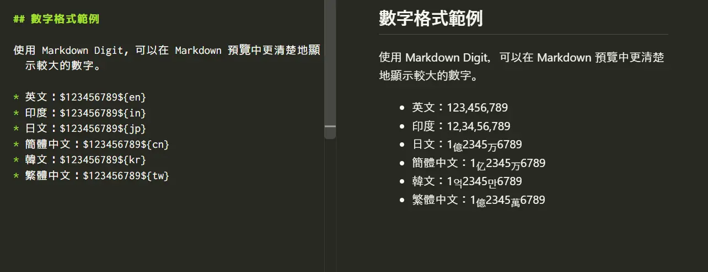

# Markdown Digit Formatter

[English](README.md) | [日本語](README.jp.md) | [简体中文](README.zh-cn.md) | [한국어](README.ko.md) | [繁體中文](README.zh-tw.md)


使用 [`markdown-it-digit`](https://www.npmjs.com/package/markdown-it-digit)，在 Visual Studio Code 的 Markdown 預覽中格式化指定地區設定的整數。

此擴充功能只會變更算繪後的預覽，不會修改編輯器中的 Markdown 原始檔。

## 安裝

在 Visual Studio Code 的擴充功能檢視中搜尋「Markdown Digit Formatter」。

## 使用方法

開啟 Markdown 檔案，使用以下語法輸入整數：

```md
$<number>${<locale>}
```

例如：

```md
$1234567${en}
```

預覽中會顯示為 `1,234,567`，原始檔不會變更。



`<number>` 必須包含一個或多個 ASCII 數字（`0`～`9`）。開頭的零會保留，地區設定識別碼區分大小寫。

## 整份文件自動格式化

在 VS Code 設定中指定預設地區設定後，可以自動格式化 Markdown 文件正文中的一般數字。自動格式化預設為停用。

```json
{
    "markdownDigit.locale": "tw",
    "markdownDigit.minDigits": 4
}
```

`markdownDigit.locale` 可設定為 `en`、`in`、`jp`、`cn`、`kr` 或 `tw`。選擇空值可停用自動格式化。

`markdownDigit.minDigits` 指定自動格式化所需的最少位數，預設值為 `4`。例如，當 `locale: en`、`minDigits: 4` 時，`999` 保持不變，而 `1000` 顯示為 `1,000`。

若要只覆寫單一文件的預設設定，請在 Markdown 檔案開頭加入 YAML Front Matter：

```yaml
---
markdown:
  digit:
    locale: tw
    minDigits: 4
---
```

在此文件中，一般數字 `123456789` 會顯示為 `1億2345萬6789`。只有位於文件開頭的 YAML Front Matter 才會被讀取。無效的 YAML 或不包含 `markdown.digit` 的 Front Matter 會被忽略，並繼續使用 VS Code 設定。

各項設定會依照下列優先順序分別解析：

```text
正文中的明確標記
> YAML Front Matter
> VS Code 設定
> 無設定
```

即使已啟用整份文件自動格式化，`$1234567${en}` 這類明確地區設定也會只覆寫該數字。使用 `$1234567${raw}` 可移除標記並原樣顯示 `1234567`。

## 支援的地區設定

| 地區設定 | `$123456789${locale}` 的預覽結果 |
| --- | --- |
| `en` | `123,456,789` |
| `in` | `12,34,56,789` |
| `jp` | `1`億`2345`万`6789` |
| `cn` | `1`亿`2345`万`6789` |
| `kr` | `1`억`2345`만`6789` |
| `tw` | `1`億`2345`萬`6789` |

東亞語言的單位會在 Markdown 預覽中以下標顯示。`jp`、`cn`、`kr` 和 `tw` 是 `markdown-it-digit` 定義的格式識別碼，並非 ISO 語言代碼或 BCP 47 語言標籤。

## 不會轉換的內容

此擴充功能不會變更以下內容：

- 未設定自動格式化地區時的一般數字
- 無效語法、不支援的地區設定或大小寫錯誤的地區設定
- 圍欄式與縮排式程式碼區塊
- 行內程式碼
- URL 和 Markdown 連結目標
- HTML 屬性和 HTML 註解
- 使用 Markdown 反斜線逸出的語法

如需完整的剖析與格式化行為，請參閱 [`markdown-it-digit` 文件](https://github.com/yusu79/markdown-it-digit#readme)及其[規格](https://github.com/yusu79/markdown-it-digit/blob/main/docs/specification.md)。

## 系統需求

- Visual Studio Code 1.125.0 或更新版本

## 授權條款

[MIT](LICENSE)
